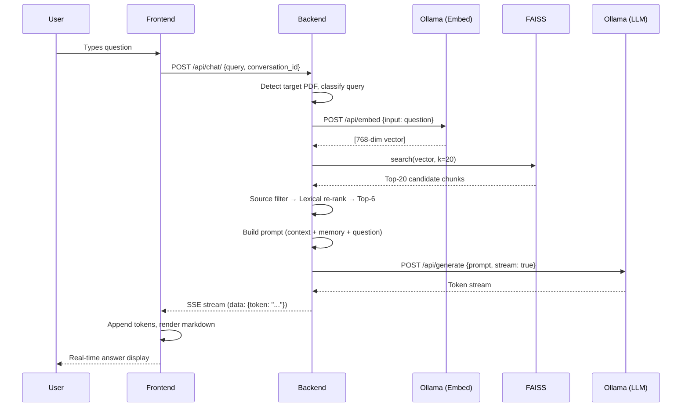

# LLM Design Document

## Overview

This document describes how the AI Knowledge Assistant integrates Large Language Models (LLMs) for document-grounded question answering. The system uses a RAG (Retrieval-Augmented Generation) architecture with Ollama as the local inference backend.

---

## Architecture


---

## Models Used

| Model | Role | Parameters | Context Window |
|---|---|---|---|
| `nomic-embed-text` | Text embedding / vectorization | 137M | 8192 tokens |
| `qwen2.5:3b` | Answer generation (default) | 3B | 8192 tokens |
| `qwen2.5:0.5b` | Lightweight alternative | 0.5B | 8192 tokens |
| `gemma2:9b` | High-quality alternative | 9B | 8192 tokens |
| `llama3:8b` | High-quality alternative | 8B | 8192 tokens |

All models run locally via **Ollama** — no external API calls, no data leaves the machine.

---

## Prompt Engineering

### System Persona

The LLM is instructed to act as a **PDF knowledge assistant** with strict grounding rules:

```
You are a PDF knowledge assistant.
IMPORTANT RULES:
1. Use ONLY the document excerpts below. NEVER use outside knowledge.
2. If the question is about a topic NOT covered in the excerpts, reply EXACTLY: "Not found in document"
3. Do NOT try to connect unrelated content to the question.
4. For definition questions, define a term only if the excerpts actually explain that term.
5. Be strict: if the excerpts don't directly address the question, say "Not found in document"
```

### Prompt Template

```
{system_persona}
{task_note}

{source_restriction (if single PDF targeted)}

Document excerpts:
{context — trimmed to 7000 chars max}

Recent chat, for conversation continuity only:
{last 3 Q/A pairs}

Current question:
{user_question}
```

### Task-Specific Instructions

The system detects the user's intent and injects a targeted instruction:

| Task Type | Detection Keywords | Instruction |
|---|---|---|
| **Summary** | summarize, overview, key points | "Summarize the available excerpts. Return 4-8 short bullets." |
| **Q&A Generation** | important questions, interview, q&a | "Create useful study questions from the content. Return numbered Q/A pairs." |
| **Notes** | notes, study, prepare | "Prepare simple notes with short headings or bullets." |
| **Direct Answer** | (default) | "Answer the user's specific question from the excerpts." |

---

## RAG Pipeline Design

### Step 1: Document Ingestion

```
PDF Upload → Text Extraction → Chunking → Embedding → FAISS Storage
```

- **Text extraction**: `pypdf` (digital PDFs) with Tesseract OCR fallback (scanned PDFs)
- **Chunking**: `RecursiveCharacterTextSplitter` with 700-char chunks and 120-char overlap
- **Embedding**: Each chunk is encoded via `nomic-embed-text` (Ollama `/api/embed`)
- **Storage**: FAISS `IndexFlatL2` (exact L2 distance search), persisted to disk per user

### Step 2: Query Processing

```
User Question → Source Detection → Query Embedding → Vector Search → Re-ranking
```

1. **Source detection**: Regex + token matching identifies if a specific PDF is referenced
2. **Query classification**: Determines if the query is summary/QA/notes/direct-answer
3. **Embedding**: Question encoded with same `nomic-embed-text` model
4. **Vector search**: FAISS returns top-k candidates (default k=6, candidate pool k=20)
5. **Source filtering**: If a PDF is targeted, only chunks from that PDF are kept
6. **Lexical re-ranking**: Chunks scored by exact keyword overlap with the question

### Step 3: Context Assembly

```
Retrieved Chunks → Source Labeling → Deduplication → Trimming (7000 chars)
```

- Chunks are prefixed with `[filename]` labels
- For summary queries, representative sampling is used (evenly spaced across document)
- Context is hard-capped at 7000 characters to fit within model context window

### Step 4: Answer Generation

```
Prompt → Ollama API → Token Stream → Post-processing → Client
```

- **Temperature**: 0.15 (low creativity, high faithfulness)
- **Top-p**: 0.9
- **Max tokens**: 512 (`num_predict`)
- **Context window**: 8192 (`num_ctx`)
- **Keep-alive**: 10 minutes (model stays loaded in memory)
- **Streaming**: Server-Sent Events (SSE) for real-time token delivery

---

## Fallback Strategies

### 1. Extractive Fallback

If the LLM is unavailable or times out, the system returns direct excerpts from the retrieved chunks:

- Sentences are scored by keyword overlap with the question
- Best sentences are extracted with a sliding window
- Deduplication ensures variety (Jaccard similarity < 0.65)

### 2. "Not Found" Detection

The system detects when the LLM responds with a "not found" variant:

```python
re.search(r"not found in (?:the )?(?:document|uploaded pdfs)", answer, re.IGNORECASE)
```

When detected, the user is offered a **global search** option that queries the LLM without RAG context (using the model's parametric knowledge).

### 3. Experience Count Heuristic

For resume-style queries like "how many experiences?", a regex-based parser extracts structured date ranges and company names directly from the context — bypassing the LLM for factual counting.

---

## Chat Memory

| Parameter | Value | Purpose |
|---|---|---|
| Max pairs | 3 | Last 3 Q/A exchanges retained |
| Format | `"User: ...\nAssistant: ..."` | Simple string-based history |
| Scope | Per-conversation | Conversations are isolated |

Memory is injected into the prompt as "recent chat for continuity" — the model uses it for coreference resolution (e.g., "it" referring to a previous topic).

---

## LLM Configuration (Environment Variables)

| Variable | Default | Description |
|---|---|---|
| `OLLAMA_BASE_URL` | `http://localhost:11434` | Ollama server address |
| `OLLAMA_MODEL` | `qwen2.5:3b` | Generation model |
| `OLLAMA_EMBED_MODEL` | `nomic-embed-text` | Embedding model |
| `OLLAMA_TIMEOUT_SECONDS` | `180` | Request timeout |
| `OLLAMA_NUM_CTX` | `8192` | Context window size |
| `OLLAMA_NUM_PREDICT` | `512` | Max output tokens |
| `OLLAMA_KEEP_ALIVE` | `10m` | Model memory retention |
| `RAG_CONTEXT_CHARS` | `7000` | Max context fed to LLM |
| `RAG_TOP_K` | `6` | Final chunks used |
| `RAG_CANDIDATE_K` | `20` | Initial retrieval pool |
| `RAG_SUMMARY_K` | `20` | Chunks for summary queries |

---

## Global Search (Non-RAG)

When documents don't contain the answer, the system offers a global search mode:

```python
SYSTEM_PROMPT = (
    "You are a helpful, accurate AI knowledge assistant. "
    "Answer the user's question clearly and concisely. "
    "Do not make up facts."
)
```

- **Temperature**: 0.7 (higher creativity for general knowledge)
- **Max tokens**: 512
- No document context is provided — pure parametric knowledge

---

## Security & Privacy

- All inference is **local** (Ollama) — no data sent to external APIs
- Per-user document isolation — users cannot access each other's FAISS indexes
- Token-based authentication required for all chat endpoints
- Context is trimmed to prevent prompt overflow attacks
- Input sanitization strips injection-style prefixes from questions

---

## Performance Considerations

| Concern | Mitigation |
|---|---|
| Cold start latency | `keep_alive=10m` keeps model in GPU/RAM |
| Large PDFs | Chunking + top-k limits context size |
| Slow embedding | Batch processing during upload (not at query time) |
| Token overflow | Hard cap at 7000 chars context + 512 output tokens |
| Irrelevant results | Lexical re-ranking + source filtering |
| LLM hallucination | Low temperature (0.15) + strict grounding prompt |

---

## Sequence: End-to-End Query


