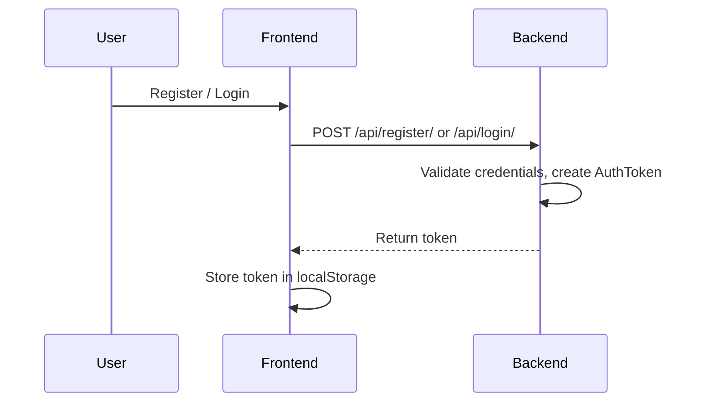
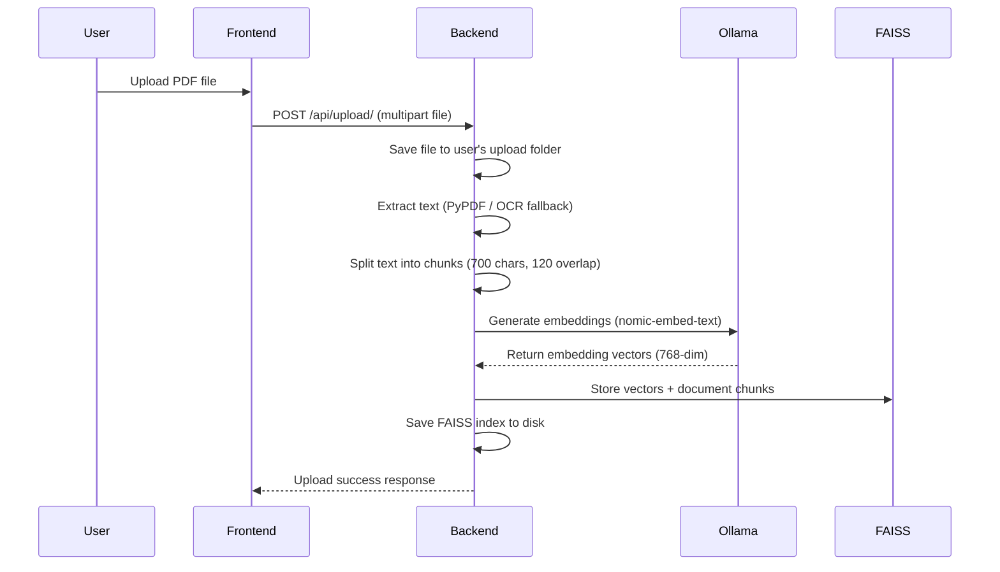
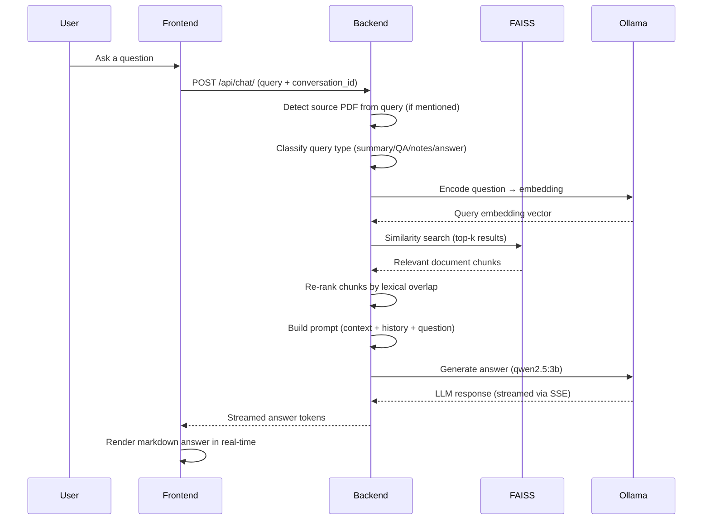
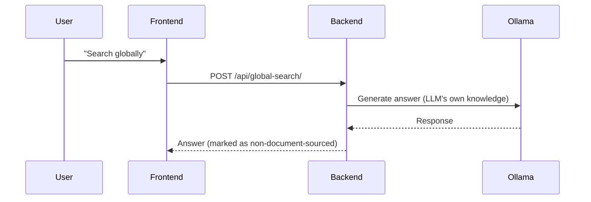
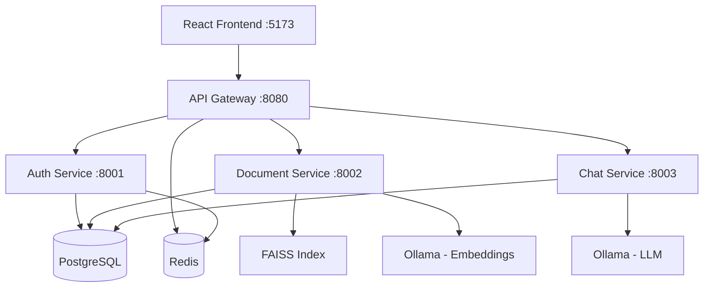

# Project Flow & Technology Stack

## Overview

AI Knowledge Assistant is a full-stack RAG (Retrieval-Augmented Generation) application that allows users to upload PDF documents and ask natural language questions about their content. The system uses vector similarity search to find relevant document sections and feeds them to a local LLM for answer generation.

---

## Technology Stack

### Frontend

| Technology | Purpose |
|---|---|
| React 19 | UI framework |
| Vite | Build tool & dev server |
| React Markdown | Render markdown-formatted answers |
| React Syntax Highlighter | Code block rendering |
| Remark GFM | GitHub-flavored markdown support |
| CSS (custom) | Styling |
| Nginx | Production static file server |

### Backend (Monolith — Django)

| Technology | Purpose |
|---|---|
| Django | Web framework, REST API, ORM |
| SQLite | User/session/conversation database |
| PyPDF / pypdf | PDF text extraction |
| pdf2image + Tesseract OCR | Fallback OCR for scanned PDFs |
| LangChain Text Splitters | Chunking documents into passages |
| FAISS (faiss-cpu) | Vector similarity search index |
| NumPy | Embedding array operations |
| Requests | HTTP client for Ollama API |

### Backend (Microservices — FastAPI)

| Technology | Purpose |
|---|---|
| FastAPI | Async API framework for each service |
| PostgreSQL 16 | Shared relational database |
| SQLAlchemy + asyncpg | Async ORM and DB driver |
| Redis 7 | Caching, rate limiting, session tokens |
| HTTPX | Async HTTP client |
| Docker + Docker Compose | Containerization & orchestration |

### AI / ML Layer

| Technology | Purpose |
|---|---|
| Ollama | Local LLM inference server |
| qwen2.5:3b | Default language model for generation |
| nomic-embed-text | Embedding model for vectorization |
| FAISS (IndexFlatL2) | L2 distance vector search |

---

## Application Flow

### 1. User Authentication



### 2. Document Upload & Indexing



### 3. Chat / Question-Answering (RAG Pipeline)



### 4. Global Search (Fallback)

When the answer is not found in uploaded documents, the user can opt for a global search that queries the LLM directly without RAG context.



---

## Microservices Flow (Docker Compose)



| Service | Port | Tech | Responsibility |
|---|---|---|---|
| Gateway | 8080 | FastAPI | Routing, auth validation, rate limiting |
| Auth | 8001 | FastAPI | Registration, login, JWT tokens, OTP, admin |
| Documents | 8002 | FastAPI | Upload, parse, embed, FAISS vector search |
| Chat | 8003 | FastAPI | Conversations, LLM queries, streaming |

---

## Data Flow Summary

```
PDF → Text Extraction → Chunking (700 chars) → Embedding (nomic-embed-text)
    → FAISS Index (per user)

Question → Embedding → FAISS Search → Top-K Chunks → Re-ranking
    → Prompt Construction → LLM Generation → Streamed Answer
```

---

## Key Design Decisions

| Decision | Rationale |
|---|---|
| Per-user FAISS index | Isolation; each user's documents are separate |
| Chunk size 700 / overlap 120 | Balances context relevance and retrieval precision |
| Lexical re-ranking after vector search | Boosts chunks with exact term matches |
| Source-aware filtering | Answers can target a specific uploaded PDF |
| Chat memory (last 3 pairs) | Provides conversational context without token overflow |
| Extractive fallback | Returns direct excerpts if LLM is unavailable |
| SSE streaming | Real-time answer delivery to frontend |
| OCR fallback | Handles scanned PDFs via Tesseract |

---

## Folder Structure

```
ai-knowledge-assistant/
├── frontend/          → React + Vite SPA
├── backend/
│   ├── app/           → RAG pipeline (embedder, FAISS, LLM, memory)
│   └── server/        → Django REST API (auth, chat, uploads)
├── services/          → Microservices (FastAPI)
│   ├── gateway/       → API gateway + rate limiting
│   ├── auth/          → Authentication service
│   ├── documents/     → Document processing service
│   └── chat/          → Chat / LLM service
└── docker-compose.yml → Container orchestration
```
